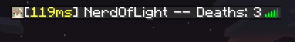

# TabStuff

---

I should have thought of a better name...

Anyways, this is where SpigotPing meets a Tab list death counter and runs in Sponge.

This is a server-side Sponge plugin. 

---
## Function

---
* Able to set Header and Footer of Tab List
* Able to show either Ping, Deaths, or both
* Able to shut itself off via configs

## Compatibility

---
* Java 8
* Tested on SpongeForge API 7.3.0 for Forge 1.12.2 only 

## Known Issues

---
* Due to Minecraft's proportional font, padding does not work properly.
  * It does achieve something passable, though.

## Plugin References

---
Of course, I didn't write this out of thin air.
* https://github.com/montlikadani/TabList/tree/Sponge-7
* https://github.com/xDefcon/spigot-ping